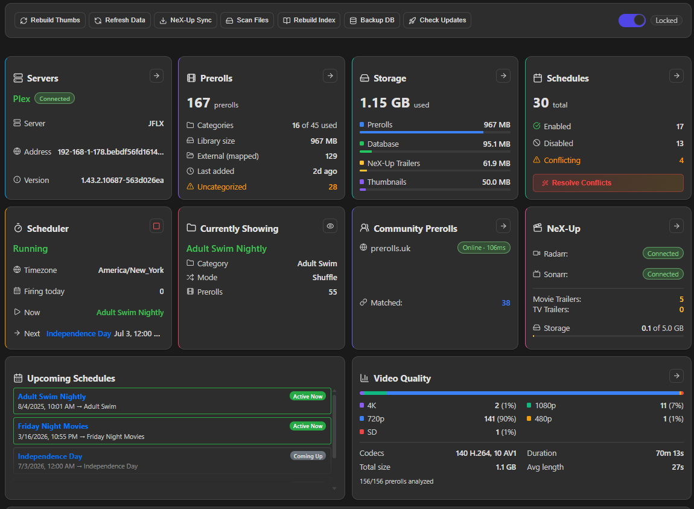
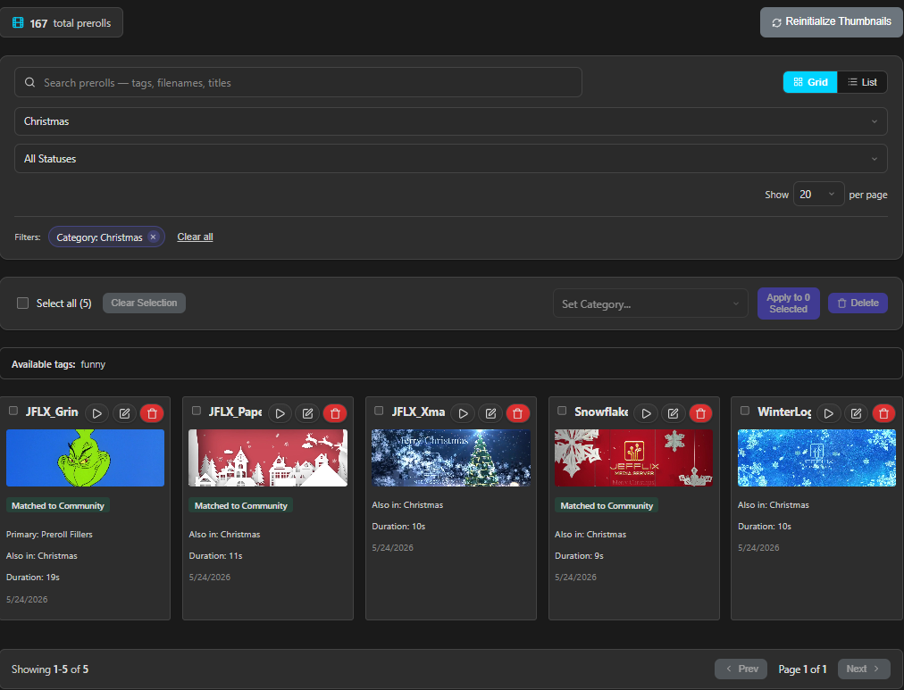
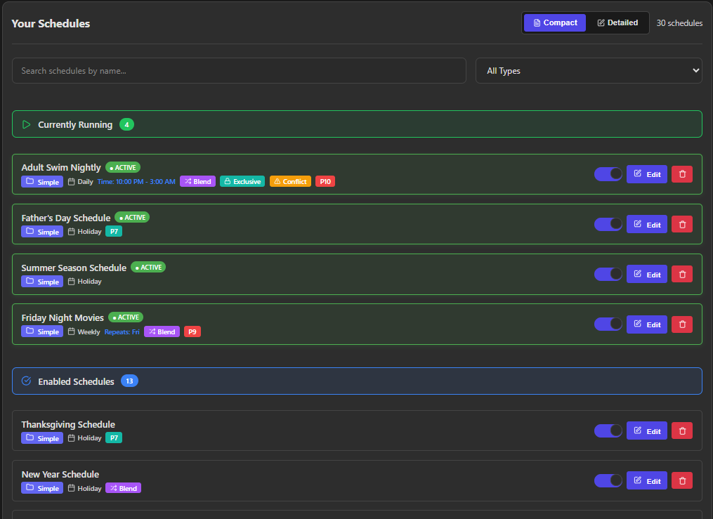
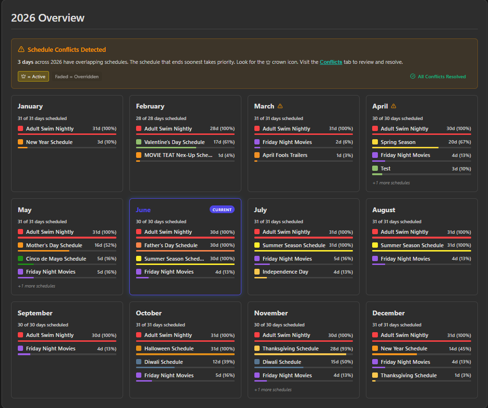
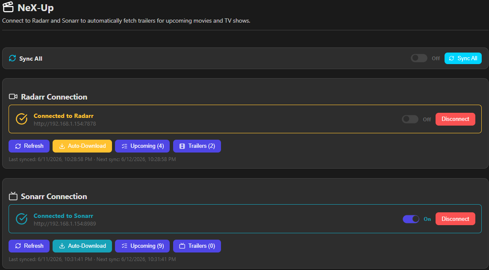
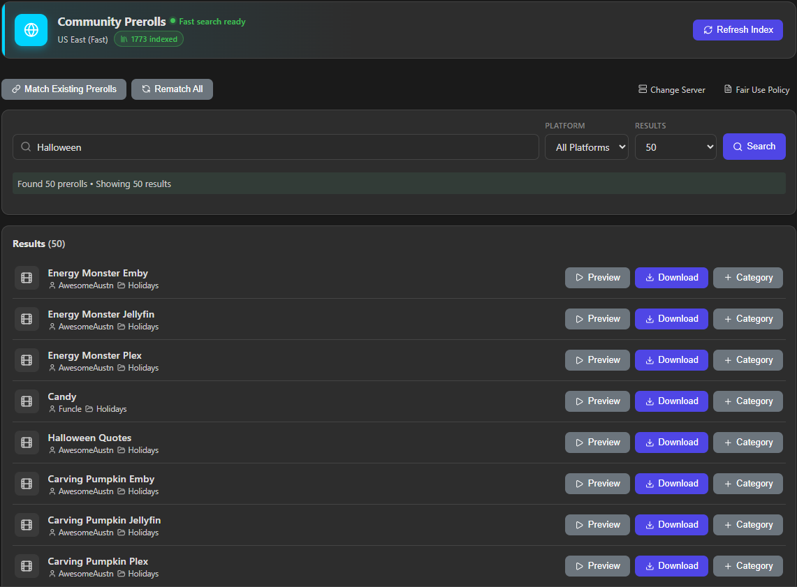

<div align="center">
  
  
  <br>
 <a href="https://github.com/JFLXCLOUD/NeXroll/releases/latest"></a>
  <a href="https://github.com/JFLXCLOUD/NeXroll/releases/latest"></a>
  <a href="https://github.com/JFLXCLOUD/NeXroll/stargazers"></a>
  <a href="https://github.com/JFLXCLOUD/NeXroll/blob/main/LICENSE"></a>
  <br>
  <a href="https://hub.docker.com/r/jbrns/nexroll"></a>
  <a href="https://discord.gg/R9eH7TbxEk"></a>

</div>

---

NeXroll is a preroll manager for Plex, Jellyfin, and Emby that makes setup effortless. It runs natively on Windows and works in Docker, featuring a clean web interface, optional background service, and lightweight tray app. Everything is self-contained, and a single installer gets you up and running in minutes.

---

## Screenshots

### Dashboard


### Preroll Management


### Schedule Management


### Calendar Year View


### NeX-Up - Radarr & Sonarr Integration


### Community Prerolls


---

## Main Features

- **Modern v2 Interface** — Collapsible "Arr-style" sidebar with built-in search and per-section colors, a redesigned dashboard with quick-action tiles, a first-run onboarding wizard, and deep-linkable pages (refresh-safe URLs)
- **NeX-Up** — Automatically download trailers for upcoming movies and TV shows from Radarr & Sonarr, with **cookie-free YouTube downloads** (a built-in PO-token provider clears the "not a bot" wall) in a Plex-friendly H.264 format, a dynamic intro generator with multi-language support (EN/FR/ES/DE), a Coming Soon List generator, and sequence builder presets
- **Preroll Management** — Upload videos, auto-generate thumbnails, organize with tags and multi-category assignments
- **Smart Scheduling** — Daily, weekly, monthly, yearly schedules with recurrence patterns, fallback categories, and visual calendar views
- **Sequence Builder** — Create ordered preroll sequences with random blocks and fixed selections
- **Schedule Blend Mode** — Automatically blend prerolls from overlapping schedules (e.g., Christmas + New Year's)
- **Priority & Exclusive Mode** — Control which schedule wins with priority levels (1-10) and exclusive override
- **Holiday Browser** — Search holidays from 100+ countries and create schedules with one click
- **Holiday Presets** — 32+ built-in holidays with one-click category and schedule creation
- **Community Prerolls** — Search and **browse** 1,700+ community prerolls (by category, platform, creator, upload date) with pagination, and download in one click
- **Media Server Integration** — Connect to Plex, Jellyfin, or Emby with status monitoring and quick apply actions; download and remotely configure the Jellyfin/Emby plugin from the Connect page
- **Backup & Restore** — Full database and file backups with one-click restore and live progress
- **Factory Reset & Redaction** — Reset to a fresh-install state from the UI, and automatic redaction of API keys/IPs in exported logs
- **Windows Native** — One-click installer with optional Windows Service and System Tray app

## Download and Install

1. Download the latest `NeXroll_Installer.exe` from GitHub Releases:
   https://github.com/JFLXCLOUD/NeXroll/releases
2. Run `NeXroll_Installer.exe` (administrator recommended).
3. Choose:
   - Install location (default: `C:\Program Files\NeXroll`)
   - Preroll storage directory (can be on any drive)
4. Optional components you may select:
   - Install as Windows Service (`NeXrollService`)
   - Plex Stable Token setup (runs `setup_plex_token.exe`)
   - Start with Windows (adds the tray app to Startup)
   - Install FFmpeg via winget (for thumbnail generation)
   - Windows Firewall rule (Allow inbound TCP 9393 for local web UI)
5. Finish the installer and open the app from the Start Menu or tray menu.

After install, visit http://localhost:9393 to use the web UI.


---

## Docker

NeXroll is available as an official Docker image supporting AMD64 and ARM64.

```bash
docker pull jbrns/nexroll:latest
```

### docker-compose (Recommended)

```yaml
version: "3.8"
services:
  nexroll:
    image: jbrns/nexroll:latest
    container_name: nexroll
    ports:
      - "9393:9393"
    environment:
      - NEXROLL_PORT=9393
      - NEXROLL_DB_DIR=/data
      - NEXROLL_PREROLL_PATH=/data/prerolls
      - NEXROLL_SECRETS_DIR=/data
      - TZ=America/New_York
    volumes:
      - ./nexroll-data:/data
      - /path/to/your/prerolls:/data/prerolls
    restart: unless-stopped
```

```bash
mkdir -p ./nexroll-data
docker compose up -d
# Access at http://YOUR_HOST:9393
```

### With NeX-Up Trailer Storage

Add a separate volume so Plex/Jellyfin/Emby can access downloaded trailers:

```yaml
    volumes:
      - ./nexroll-data:/data
      - /path/to/your/prerolls:/data/prerolls
      - /path/to/trailers:/data/nexup_trailers
```

Then set **NeX-Up → Settings → Storage Path** to `/data/nexup_trailers`.

### Key Environment Variables

| Variable | Description | Default |
|----------|-------------|---------|
| `NEXROLL_PORT` | Web UI port | `9393` |
| `NEXROLL_DB_DIR` | Database & config directory | `/data` |
| `NEXROLL_PREROLL_PATH` | Preroll storage directory | `/data/prerolls` |
| `NEXROLL_SECRETS_DIR` | Secrets storage directory | `/data` |
| `TZ` | Timezone — **required for correct scheduling** | `UTC` |
| `PUID` / `PGID` | File permission user/group IDs | `99` / `100` |

### Path Mappings

Because NeXroll runs inside a container, paths it sees differ from what your media server sees. Configure **Settings → Path Mappings** to translate container paths to media server paths.

| Scenario | NeXroll Path | Media Server Path |
|----------|--------------|-------------------|
| Docker → Linux Plex | `/data/prerolls` | `/media/prerolls` |
| Docker → Windows Plex | `/data/prerolls` | `Z:\Prerolls` |
| Unraid → Unraid Plex | `/data/prerolls` | `/mnt/user/media/prerolls` |

### Updating

```bash
docker pull jbrns/nexroll:latest
docker compose up -d --force-recreate
```

For full Docker documentation including full-stack examples, Linux host networking, and detailed troubleshooting see the [Docker wiki page](docs/wiki/Docker.md).

---

## Unraid

NeXroll is available in **Unraid Community Applications**.

1. Open **Apps** in Unraid and search for **NeXroll**
2. Click **Install**
3. Configure paths:

| Setting | Container Path | Suggested Host Path |
|---------|---------------|---------------------|
| WebUI Port | 9393 | 9393 |
| Application Data | `/data` | `/mnt/user/appdata/nexroll` |
| Preroll Storage | `/data/prerolls` | `/mnt/user/media/prerolls` |
| Trailer Storage | `/data/nexup_trailers` | `/mnt/user/media/trailers` |
| Time Zone | `TZ` | e.g. `America/New_York` |

4. Click **Apply**, then open the WebUI at `http://YOUR_UNRAID_IP:9393`

> **Important:** The Preroll Storage path must be accessible by your media server (Plex/Jellyfin/Emby). If your media server is also running on Unraid, mount the same share to both containers and set a Path Mapping in NeXroll Settings so paths translate correctly.

---

## What 's Installed

- `NeXroll.exe`   the web application (FastAPI + bundled frontend)
- `NeXrollService.exe`   optional Windows Service wrapper
- `NeXrollTray.exe`   system tray app with quick actions
- `setup_plex_token.exe`   helper to obtain a stable Plex token

Start Menu shortcuts are created for NeXroll, NeXroll Tray, and Uninstall NeXroll. A desktop shortcut for NeXroll is also added.


---

## System Tray App

The tray icon provides quick actions:
- Open   launches http://localhost:9393 (default action)
- Start Service   attempts to start the Windows service (if installed)
- Stop Service   stops the Windows service (if installed)
- Restart Service   restarts the Windows service (if installed)
- Start App (portable)   starts the packaged app directly (non service)
- Check for updates   checks GitHub Releases and opens the latest release if a newer version is available (dialog is foreground and closable)
- About   shows app information (dialog is foreground and closable)
- GitHub   opens https://github.com/JFLXCLOUD/NeXroll
- Exit   closes the tray app

If you selected Start with Windows, the tray app launches automatically at login.

---

## Windows Service (Optional)

If chosen during installation, the `NeXrollService` Windows Service is installed. You can manage it via Services.msc or the following commands (run from `C:\Program Files\NeXroll` or your chosen InstallDir):

```
NeXrollService.exe install
NeXrollService.exe start
NeXrollService.exe stop
NeXrollService.exe remove
```

Logs (service mode): `%ProgramData%\NeXroll\logs\service.log`
Logs (packaged app): `%ProgramData%\NeXroll\logs\app.log`
Logs (tray): `%ProgramData%\NeXroll\logs\tray.log`
Database (packaged): `%ProgramData%\NeXroll\nexroll.db`

Tip: if a previous NeXroll instance is still running and occupying port 9393, the service may need a second start attempt after that instance is closed.

---

## Requirements

- Windows 10/11 x64
- FFmpeg for thumbnail generation (you can install it from the installer's optional components, or manually)
- Network access to your Plex, Jellyfin, or Emby server
- No Python required on user machines

---

## First Time Setup

1. Open http://localhost:9393
2. Connect to your media server:
   - Connect to Plex, Jellyfin, or Emby using URL and credentials
   - For Plex: Use your Plex URL and token; or run `setup_plex_token.exe` to create a long lived "stable token"
3. Upload prerolls, create categories, and configure schedules.

---

## Upgrade / Uninstall

- Upgrade: simply run the newer `NeXroll_Installer.exe` over the existing installation. Your configured Preroll storage path is preserved, and data is not removed.
- Uninstall: use "Uninstall NeXroll" from the Start Menu (or Apps & Features). The installer removes the service and shortcuts; your Preroll storage directory is not deleted.

---

## Building From Source

See the full packaging guide in `NeXroll/Docs/PACKAGING.md`.

Prerequisites (build machine):
- Python 3.10+ (build time only)
- pip install: `pyinstaller`, `pywin32`, `pystray`, `Pillow`
- NSIS 3.x (`makensis` on PATH)

Build commands (run from the repository root):

```
py -m PyInstaller -y NeXroll\build\neXroll.spec
py -m PyInstaller -y NeXroll\build\NeXrollService.spec
py -m PyInstaller -y NeXroll\build\setup_plex_token.spec
py -m PyInstaller -y NeXroll\build\NeXrollTray.spec

makensis NeXroll\build\installer.nsi
```

Outputs:
- `dist\NeXroll.exe`
- `dist\NeXrollService.exe`
- `dist\setup_plex_token.exe`
- `dist\NeXrollTray.exe`
- `NeXroll\build\NeXroll_Installer.exe`  (Release asset is published as a generic name)

---


## Project Structure

- Backend (FastAPI): `NeXroll/backend/`
- Packaged runtime backend: `NeXroll/backend/`
- Frontend (static build served by backend): `NeXroll/frontend/`
- Windows Service wrapper: `NeXroll/scripts/windows_service.py`
- System tray app: `NeXroll/scripts/tray_app.py`
- PyInstaller specs:
  - `NeXroll/build/neXroll.spec`
  - `NeXroll/build/NeXrollService.spec`
  - `NeXroll/build/NeXrollTray.spec`
  - `NeXroll/build/setup_plex_token.spec`
- NSIS installer: `NeXroll/build/installer.nsi`

---

## Troubleshooting

- "Service did not respond in time"
  - Ensure no other process is using port 9393; stop any `NeXroll.exe` that 's running, then start the service again.
- UI not reachable at http://localhost:9393
  - If you selected the firewall component, verify the inbound rule "NeXroll (TCP 9393)" exists. Otherwise, allow inbound TCP 9393 or re-run the installer and select the firewall option.
- Service logs location
  - Check `%ProgramData%\NeXroll\logs\service.log` for service-mode startup and health probe messages.
- Thumbnails not created
  - Install FFmpeg (choose the installer component, or install manually); re upload a preroll.
- Tray icon not shown
  - Run "NeXroll Tray" from Start Menu; pin it so it's always visible.
- Media server connection issues
  - Verify your Plex, Jellyfin, or Emby server is reachable from the machine, and credentials are valid (retry `setup_plex_token.exe` for Plex if needed).

---

## License

MIT. Third party components remain under their respective licenses.


---

## Support

If NeXroll is helpful, consider supporting ongoing development:

[](https://ko-fi.com/j_b__)

Join the community on Discord for support, feature requests, and discussions:

[](https://discord.gg/R9eH7TbxEk)

Join the subreddit:

[](https://www.reddit.com/r/NeXroll/)

---

## Credits

Community Prerolls powered by [Typical Nerds](https://typicalnerds.uk/) - Thank you for making thousands of prerolls available to the community!

---

## A Note of Transparency

I have immense respect for software developers and the craft of programming. I want to be upfront: I'm not a professional developer — I'm an IT manager with a passion for media server environments and home automation.

NeXroll was made possible through collaboration with [Claude](https://www.anthropic.com/claude) (Anthropic's AI assistant). From architecture decisions to debugging edge cases, Claude was an invaluable partner in bringing this project to life. This transparency feels important in an era where AI-assisted development is becoming more common.

If you're a developer reviewing this code, I welcome feedback, pull requests, and patience with any rough edges. The goal was always to create something useful for the Plex/Jellyfin community, and I hope NeXroll delivers on that.

