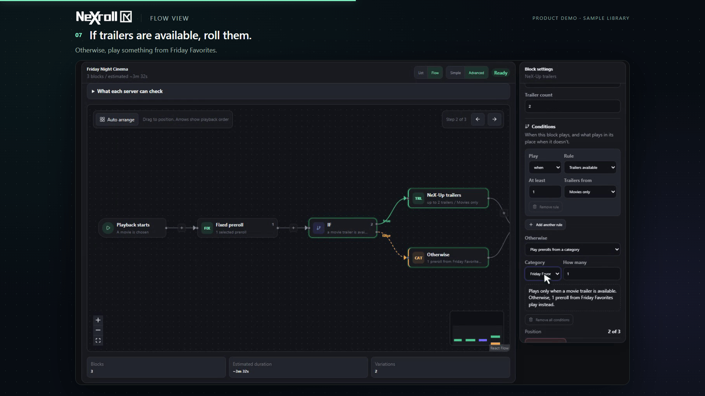

  
  
  
Make the start of the movie part of the experience.

  

    <a href="https://github.com/JFLXCLOUD/NeXroll/releases">Downloads</a> ·
    <a href="docs/wiki/Getting-Started.md">Getting started</a> ·
    <a href="docs/wiki/Home.md">Documentation</a> ·
    <a href="https://discord.gg/R9eH7TbxEk">Discord</a> ·
    <a href="https://ko-fi.com/j_b__">Support on Ko-fi</a>
  

  

    
    
    
  

**NeXroll brings a cinema-style preshow to Plex, Jellyfin, and Emby.** Mix intro videos, trailers, and custom welcome screens into sequences that play before your movies. Keep movie nights fresh with automatic rotation, seasonal schedules, and prerolls from the community.

Self-hosted on **Windows, Docker, or Unraid**, with everything managed from your browser.

> **2.2.0 beta preview.** The features and screenshots below include the upcoming 2.2.0 release. [Try the beta](https://github.com/JFLXCLOUD/NeXroll/releases/tag/v2.2.0-beta.11) or [download the latest stable release](https://github.com/JFLXCLOUD/NeXroll/releases/latest).

*Screenshots show the 2.2.0 beta interface with example data and demonstration artwork.*

## Features at a glance

- **Visual sequences.** Combine intros, trailers, and pauses in a list or Flow view, with conditional branches and fallback selections.
- **Automatic scheduling.** Plan everyday rotations, holiday themes, and special events, with filler selections between schedules.
- **A library of your own.** Import, preview, tag, and organize prerolls. Random selections cycle through eligible videos before repeating.
- **NeX-Up trailers.** Bring in upcoming movie and TV trailers through Radarr and Sonarr, plus trailers for movies already in your Radarr library.
- **Generator Studio.** Create welcome videos, announcements, QR code screens, and Coming Soon videos with your own text, logo, backdrop, and soundtrack.
- **Community Prerolls.** Browse, preview, and download videos by category, creator, or platform.
- **Multiple media servers.** Connect Plex, Jellyfin, and Emby to the same NeXroll installation and share your schedules across them.
- **Make it yours.** Eight themes, a responsive interface, backup and restore, and an External API for automation.

## A look inside

### Sequence builder & Flow view

Build your preshow visually, from the first intro to the final trailer. Flow view shows each step and its branches, so you can see what plays when a condition is met and what takes its place otherwise. Arrange the canvas without changing playback order, then preview the sequence before scheduling it.

Rules can respond to trailer availability, time of day, genre, or whether a movie or episode is starting. **Genre and movie-or-episode rules require Jellyfin or Emby; Plex uses the fallback you choose for those rules.**

### Preroll library

Your collection in one place, with video previews, categories, tags, and filters for finding the right intro for any occasion.

### Schedules & calendar

Give movie night a different opening throughout the year. Recurring schedules, event dates, priorities, and filler selections keep the preshow changing automatically.

Month, week, and day views show what's planned and where schedules overlap.

### NeX-Up & Generator Studio

Show trailers for upcoming releases or rediscover movies you already own with Library Trailers. NeX-Up can use existing trailer files or download available trailers through Radarr and Sonarr integrations.

Add a personal touch with custom welcome screens, announcements, and Coming Soon videos. Generator Studio combines templates and a live preview with control over text, colors, timing, and music.

### Community Prerolls

Find a new opening for your next movie night. Browse the collection, preview videos, and add your favorites straight to your library.

Powered by [TypicalNerds](https://typicalnerds.uk/). Thank you to TypicalNerds and the creators who share their work with the community.

## Works with your setup

| Media server | Integration |
| --- | --- |
| **Plex** | Updates your server's preroll selection from active schedules and filler. [Connection guide](docs/wiki/Connect.md) |
| **Jellyfin** | Delivers intros through the NeXroll Intros plugin, with builds for Jellyfin 10.11 and 12. [Plugin guide](docs/wiki/Jellyfin.md) · [Jellyfin 12](Plugins/NeXroll.Jellyfin12/README.md) |
| **Emby** | Delivers movie and episode intros through the NeXroll Intros plugin. [Plugin guide](docs/wiki/Emby.md) |

Plex uses a shared server-wide preroll setting; playback-triggered changes are best effort. Jellyfin and Emby request intros at playback time, with support depending on the client. See [path mapping](docs/wiki/Path-Mappings.md) for media access requirements.

## Get NeXroll

- **Windows:** [Download the installer](https://github.com/JFLXCLOUD/NeXroll/releases) for Windows 10 or 11 (64-bit).
- **Docker:** [Docker setup](docs/wiki/Docker.md), with AMD64 and ARM64 images.
- **Unraid:** Find **NeXroll** in Community Applications.

Open the WebUI on port **9393** and follow the setup wizard. The [getting started guide](docs/wiki/Getting-Started.md) covers your first connection and preroll.

## Learn more & get involved

[Documentation](docs/wiki/Home.md) · [What's new](NeXroll/CHANGELOG.md) · [Sequences](docs/wiki/Sequences.md) · [NeX-Up](docs/wiki/NeX-Up.md) · [External API](docs/wiki/API.md) · [Troubleshooting](docs/wiki/Troubleshooting.md)

Questions or ideas? Join [Discord](https://discord.gg/R9eH7TbxEk) or [r/NeXroll](https://www.reddit.com/r/NeXroll/), or report a bug on [GitHub Issues](https://github.com/JFLXCLOUD/NeXroll/issues).

If NeXroll adds something to your movie nights, [support its development on Ko-fi](https://ko-fi.com/j_b__). Thank you to everyone who contributes, shares feedback, or helps other users.

Released under the [MIT License](LICENSE). Third-party components and community media retain their own licenses and usage terms.
