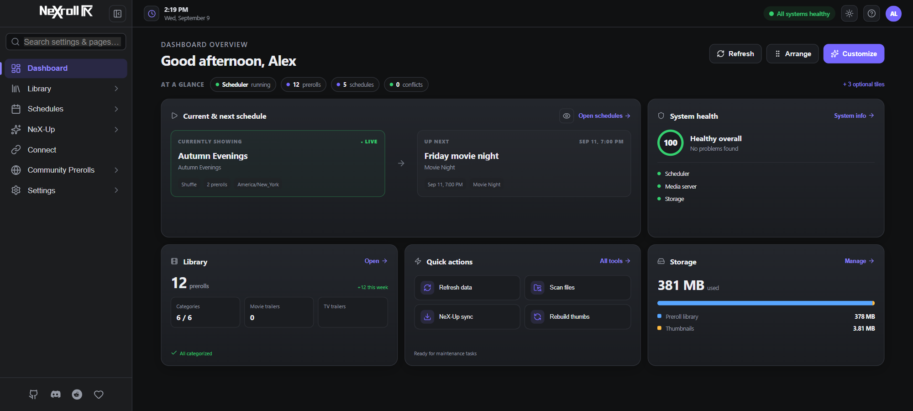
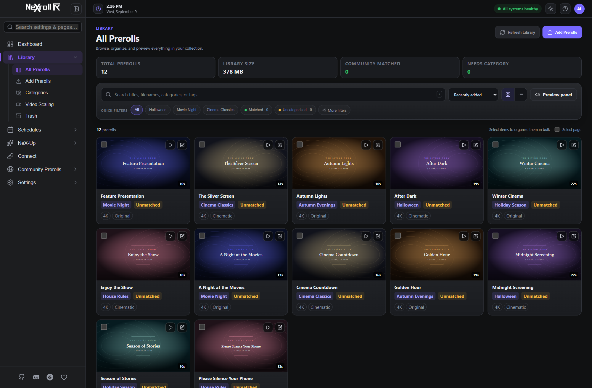
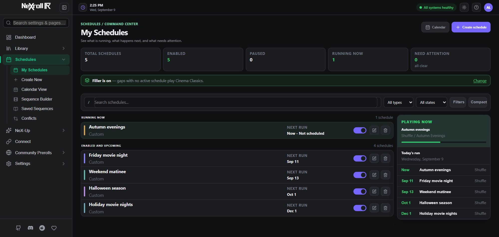
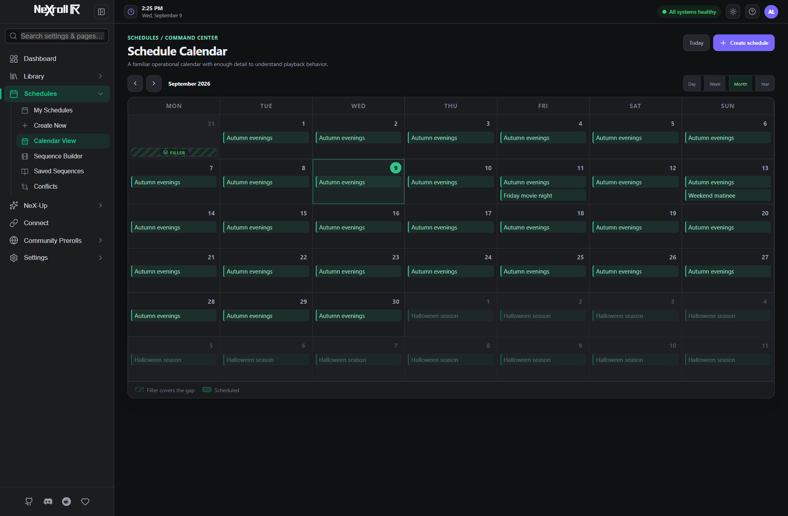
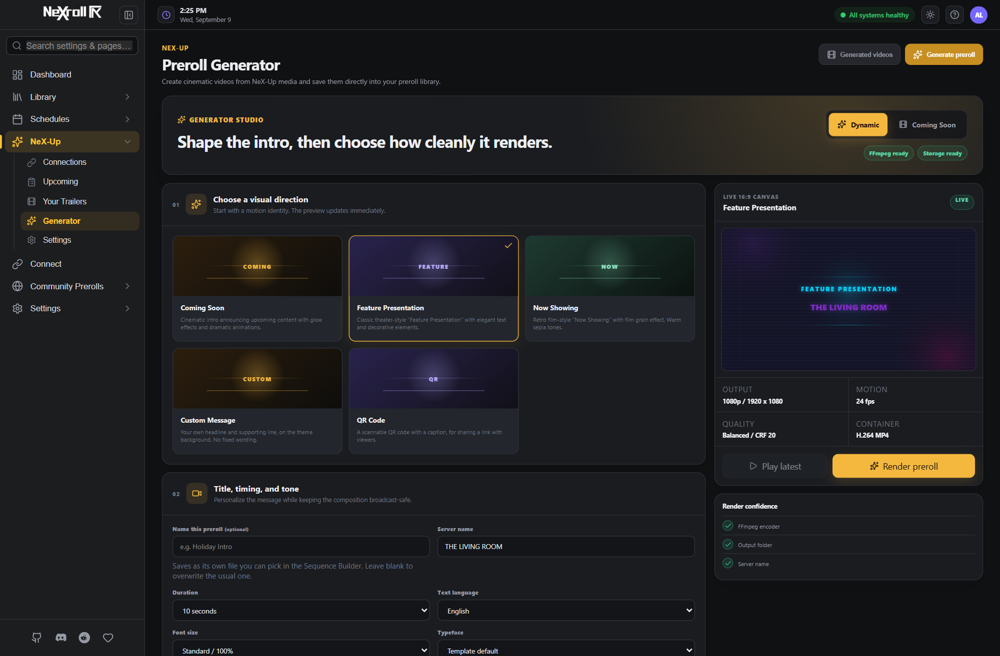
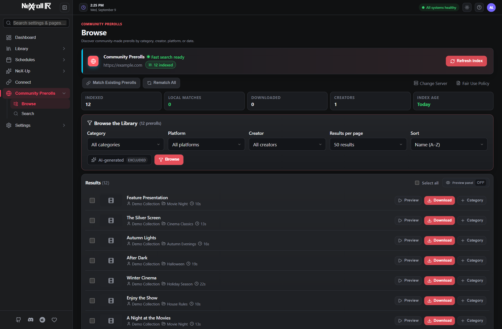

<div align="center">
  
  
  <p>Make the start of the movie part of the experience.</p>
  <p>
    <a href="https://github.com/JFLXCLOUD/NeXroll/releases">Downloads</a> ·
    <a href="docs/wiki/Getting-Started.md">Getting started</a> ·
    <a href="docs/wiki/Home.md">Documentation</a> ·
    <a href="https://discord.gg/R9eH7TbxEk">Discord</a> ·
    <a href="https://ko-fi.com/j_b__">Support on Ko-fi</a>
  </p>
</div>

> **2.2.0 beta.** This README describes the upcoming 2.2.0 release. [Try 2.2.0-beta.9](https://github.com/JFLXCLOUD/NeXroll/releases/tag/v2.2.0-beta.9), or use the [latest stable release](https://github.com/JFLXCLOUD/NeXroll/releases/latest).

NeXroll manages prerolls for **Plex, Jellyfin, and Emby**. Organize your intro videos, build a sequence for movie night, and schedule something different for a holiday or a season. NeX-Up adds trailers from your Radarr and Sonarr libraries, plus tools for creating your own welcome screens, announcements, and Coming Soon videos.

Run it on Windows, in Docker, or on Unraid. Manage everything from your browser.



*Screenshots show the 2.2.0 beta interface with example data and demonstration artwork.*

## What's new in 2.2.0

- **A clearer view of your setup.** See what's playing, what comes next, and what needs attention. Library filters, schedule controls, and connection pages follow a consistent layout, with navigation that adapts to smaller screens.
- **Eight themes across the whole app.** Choose Midnight, Daylight, Cinema, Nocturne, Parchment, Terminal, Neon, or Carbon.
- **NeX-Up Generator Studio.** Create a preroll with a live preview, then adjust the template, text, typeface, colors, timing, and soundtrack. Add your own logo or video backdrop, write a custom message, or include a QR code.
- **More useful calendar views.** Browse schedules by month, week, or day. See filler coverage, open a day for details, and review overlapping schedules and their priorities.
- **Community browsing improvements.** Filter by category, creator, or platform, and select several prerolls to download together.
- **Generator API access.** Start a dynamic preroll or Coming Soon render from another tool and check its progress through the External API.
- **Jellyfin 12 support.** A separate plugin build supports Jellyfin 12, alongside the existing Jellyfin 10.11 build. The connector also uses the authentication header required by Jellyfin 12.

See the [changelog](NeXroll/CHANGELOG.md) for the full set of changes and fixes.

## Build your preshow

### Keep your collection organized

Upload or import prerolls, preview them, and organize them with categories and tags. A video can belong to more than one category. Filters help you find the videos you want without mixing your permanent collection with automatically managed trailers and generator output.

<details>
<summary>View the preroll library</summary>



</details>

### Set the schedule once

Create recurring schedules or use a date range for a one-off event. Choose a category or a saved sequence, set its priority, and decide how it behaves when schedules overlap. Filler provides a selection for the gaps between schedules.

<details>
<summary>View schedules and the calendar</summary>





</details>

### Put the sequence together

Combine fixed videos, random selections from categories, and pauses in a saved sequence. Use the same sequence in more than one schedule. Random selections cycle through eligible videos before repeating.

### Bring upcoming releases into the mix

Connect Radarr and Sonarr to NeX-Up to find and download trailers for upcoming movies and TV releases. Choose how many to include, manage the downloaded files, and set when old trailers should be removed.

Use Generator Studio to create a welcome video, an announcement, a QR code screen, or a Coming Soon list with your own presentation style.

<details>
<summary>View Generator Studio</summary>



</details>

YouTube can restrict downloads through rate limits, IP blocks, or authentication checks. NeX-Up includes download diagnostics and PO-token support, but it cannot guarantee access to every trailer or remove a YouTube block.

### Find something from the community

Search and browse Community Prerolls by theme, category, creator, or platform. Preview a selection, choose a category, and add it to your library.

Community Prerolls is powered by [TypicalNerds](https://typicalnerds.uk/). A big thank you to TypicalNerds for making the collection available, and to the creators who contribute their prerolls for everyone to enjoy.

<details>
<summary>View Community Prerolls</summary>



The titles and collection names in this screenshot are demonstration content.

</details>

## Choose your media server

| Server | How NeXroll connects |
| --- | --- |
| **Plex** | Updates the server's preroll selection from your active schedule or filler settings. Plex needs access to the video files through paths it can read. |
| **Jellyfin** | The NeXroll Intros plugin requests the current selection when Jellyfin asks for intros. Install the plugin build that matches your Jellyfin server version. |
| **Emby** | The NeXroll Intros plugin requests intros from NeXroll. Configure it for the movies or episodes you want to include. |

Plex's preroll setting is shared across the server. Playback-triggered changes are best effort, and a change may wait while a movie is playing. Jellyfin and Emby use their plugin intro flow; playback behavior also depends on the client.

Setup guides: [Plex and connections](docs/wiki/Connect.md), [Jellyfin](docs/wiki/Jellyfin.md), [Jellyfin 12 plugin](Plugins/NeXroll.Jellyfin12/README.md), [Emby](docs/wiki/Emby.md).

## Install NeXroll

### Windows

1. Download the Windows installer from [GitHub Releases](https://github.com/JFLXCLOUD/NeXroll/releases).
2. Run the installer and choose where to keep your prerolls. You can also install the Windows service and tray app.
3. Open `http://localhost:9393` and follow the setup wizard.

Windows 10 or 11, 64-bit, is supported. You do not need to install Python. FFmpeg is used for thumbnails and video generation; see the [installation guide](docs/wiki/Installation.md) for setup options.

### Docker

Create a `compose.yaml` file:

```yaml
services:
  nexroll:
    image: jbrns/nexroll:latest
    container_name: nexroll
    ports:
      - "9393:9393"
    environment:
      TZ: America/New_York
      NEXROLL_DB_DIR: /data
      NEXROLL_SECRETS_DIR: /data
      NEXROLL_PREROLL_PATH: /data/prerolls
    volumes:
      - ./nexroll-data:/data
      - /path/to/prerolls:/data/prerolls
      - /path/to/trailers:/data/nexup_trailers
    restart: unless-stopped
```

Replace the host paths and timezone with your own, then run:

```bash
docker compose up -d
```

Open `http://YOUR_SERVER:9393`. If you use the separate trailer folder above, set NeX-Up's storage path to `/data/nexup_trailers`.

The Docker image supports AMD64 and ARM64. The `latest` tag follows stable releases; `beta` follows prereleases. See the [Docker guide](docs/wiki/Docker.md) for permissions and additional configuration.

### Unraid

Find **NeXroll** in Community Applications. Set the app-data, preroll, and optional trailer paths, check your timezone, then open the WebUI and complete setup.

### Check your file paths

A successful connection does not mean the media server can read your videos. For Plex, map NeXroll's paths to the paths visible inside Plex's own container or service. For example, `/data/prerolls` in NeXroll might be `/media/prerolls` in Plex.

Jellyfin and Emby plugins can use mapped local paths or download intros through NeXroll's streaming URL. Make sure the plugin can reach NeXroll and has access to its cache location.

Read the [path-mapping guide](docs/wiki/Path-Mappings.md) if the connection works but prerolls do not play.

## Start with one movie night

1. Connect your media server in **Connect**.
2. Add a few videos to **Library** and put them in a category.
3. Create a schedule, or use the category as your filler selection.
4. Start a movie from the beginning on your usual playback client and check the full preroll-to-movie flow.
5. Add sequences, seasonal schedules, or NeX-Up when you're ready.

## Updating and backups

Create a backup in **Settings > Backup & Restore** before updating.

On Windows, run the newer installer over your existing installation. For Docker:

```bash
docker compose pull
docker compose up -d
```

Keep your existing data volumes and media folders. See [backup and restore](docs/wiki/Backup-and-Restore.md) for moving an installation or restoring a backup.

## Help and documentation

- [Getting started](docs/wiki/Getting-Started.md)
- [Scheduling](docs/wiki/Scheduling.md) and [sequences](docs/wiki/Sequences.md)
- [NeX-Up](docs/wiki/NeX-Up.md)
- [External API](docs/wiki/API.md)
- [Troubleshooting](docs/wiki/Troubleshooting.md)
- [Building from source](docs/wiki/Building-from-Source.md)

For support, join [Discord](https://discord.gg/R9eH7TbxEk) or [r/NeXroll](https://www.reddit.com/r/NeXroll/). Report reproducible bugs through [GitHub Issues](https://github.com/JFLXCLOUD/NeXroll/issues), with your NeXroll version, installation type, media server and client versions, and relevant logs. Remove tokens and API keys before sharing.

## Support NeXroll

If NeXroll adds something to your movie nights, you can [support its development on Ko-fi](https://ko-fi.com/j_b__). Donations help support continued development and maintenance. Thank you to everyone who contributes, shares feedback, or helps other users get set up.

## License

NeXroll is released under the [MIT License](LICENSE). Third-party components and community media retain their own licenses and usage terms.
